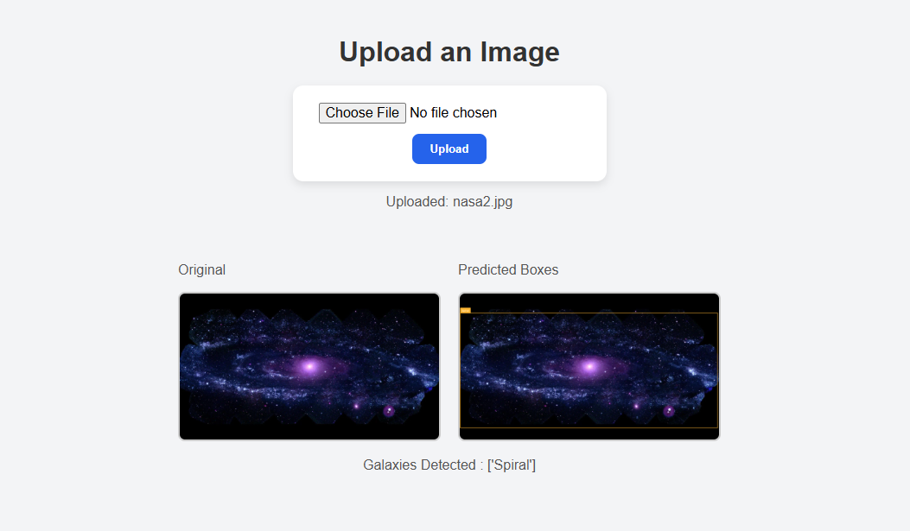

# 🌌 Galaxy Detection Web App

This is a simple Flask-based web application that automatically detects galaxies in an uploaded image using a computer vision model via the Roboflow API.

Just upload an image of space, and the app will return the image with detected galaxies annotated — all within seconds!

This type of technology is implemented in many modern telescopes used in space exploration.

---

## 🔧 Prerequisites

Before running the application, make sure the following are set up:

### ✅ Python
Ensure Python 3.7 or later is installed.

To check:
```bash
python --version
```

### ✅ Roboflow Account & API Key
- Sign up at [https://app.roboflow.com](https://app.roboflow.com)
- Create a project (e.g., Galaxy Detection)
- Get your **API key** from your Roboflow dashboard, for the assignment API KEY is attached to save time

### ✅ Virtual Environment (Recommended)
Set up a virtual environment:
```bash
python -m venv venv
source venv/bin/activate     # On Windows: venv\Scripts\activate
```

---

## 📦 Installation

Install the required Python packages:
```bash
pip install flask supervision opencv-python os inference_sdk
```

---

## 🚀 Running the App

1. Place your Roboflow API key inside `app.py` where indicated.
2. Run the Flask app:
```bash
python app.py
```
3. Open your browser and go to the port that shows in the terminal for you, example:  
[http://localhost:5000](http://localhost:5000)

---

## 💡 How It Works

1. Upload an image through the web interface.
2. The image is sent to Roboflow’s API for prediction.
3. The app downloads the annotated image and displays it back to you.

---

## 📂 Project Structure

```
NASA_GALAXY_OD/
│
├── docs/
│   └── reflection.md            # Main Flask application
├── templates/
│   └── index.html
|   └── template1..html          # HTML form for image upload, just to showcase the process
├── app.py                # main app
├── flaskApp.py           # showcase sample of flask app
├── inferenceScript.py    # showcase the script of the inference
├── uploads/
│   └── output.jpg        # Annotated result saved here
├── venv/                 # (Optional) Virtual environment
└── README.md             # Project documentation
```

---

## 📸 Example Output

Upload an image of deep space, and get back a result like this (example image after detection):



---

## 📫 Contact

For any questions, feel free to open an issue or reach out.

Happy galaxy hunting! 🚀
